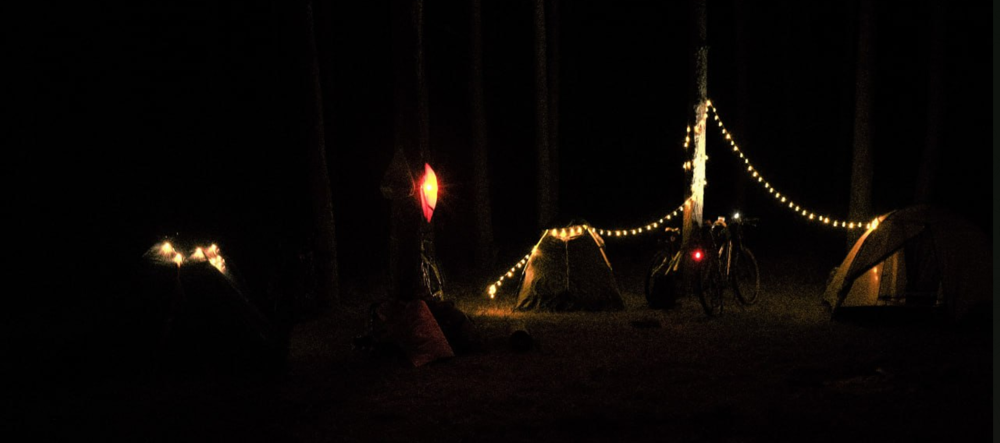

## Заплечнік


_**Сапраўдныя вандроўнікі не вандруюць без "Заплечніку".**_

### Запуск проекта
Чтобы развернуть проект, на локальной машине должен быть установлен Docker (вместе docker compose).
В консоли (в корне проекта) нужно ввести команду:
```bash
docker compose up --build
```
В первый раз, образы могут собираться несколько минут. При успешной сборки запуститься 3 сервиса:
- **_backend_** слушает 8000-й порт на Laravel (http://localhost:8000)
- **_frontend_** слушает 80-й порт и возвращает статические файлы: HTML, CSS, JS (http://localhost)
- **_postgis_** пространственная СУБД (http://localhost:5432)

#### Примечание
Docker шустро работает на linux, но может подтормаживать на windows и mac.
Для mac - нужно настроить докер, для Windows - лучше работать используя WSL.